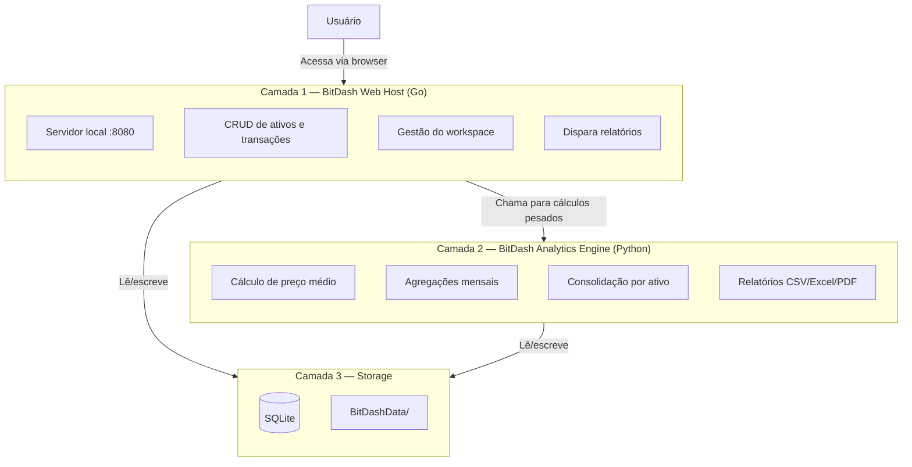

# 🪙 BitDash-standalone
 
<p align="center">
  
  
  
  
  
</p>
<p align="center">
  <strong>Aplicação local-first para gestão de lançamentos e retiradas de criptoativos, com dashboards analíticos 100% standalone — sem backend externo, sem nuvem.</strong>
</p>
---
 
## 📑 Navegue pelo projeto
 
| 🎯 [Visão geral](#-visão-geral) | 🚀 [Início rápido](#-início-rápido) | 🏗️ [Estrutura](#-estrutura-do-workspace) | 📋 [Arquitetura](#-arquitetura) | ✅ [Funcionalidades](#-funcionalidades) | 📜 [Changelog](#-changelog) |
|:---:|:---:|:---:|:---:|:---:|:---:|
 
---
 
## 🎯 Visão geral
 
**BitDash-standalone** é uma aplicação local para controle e análise de movimentações de criptoativos. Seu objetivo é registrar lançamentos e retiradas, consolidar informações por ativo e visualizar indicadores e gráficos sem depender de backend externo ou armazenamento em nuvem. Todos os dados são mantidos localmente, em banco SQLite e/ou em uma estrutura de pasta reconhecida pelo aplicativo.
 
> *"Seus dados de cripto não precisam morar na nuvem de outra pessoa."*
 
### ✨ Por que local-first?
 
- **Privacidade**: nenhum dado de carteira ou transação sai da sua máquina.
- **Simplicidade operacional**: sem servidores para manter, sem contas para criar.
- **Portabilidade**: a pasta `BitDashData/` pode ser copiada, movida ou versionada como um único pacote.
- **Resiliência**: backup e restauração simples via export/import de JSON/CSV, sem dependência de terceiros.
---
 
## 🚀 Início rápido
 
### 1. Primeira execução
 
Na primeira execução, o app verifica se já existe configuração local. Se não existir, ele oferece duas opções:
 
```text
[1] Usar pasta padrão do BitDash
[2] Escolher pasta manualmente
```
 
### 2. Inicialização da estrutura
 
Com a pasta definida, o app cria automaticamente:
 
```bash
# Estrutura criada na primeira execução
BitDashData/
├─ bitdash.db
└─ bitdash.config.json
```
 
### 3. Apontando para uma pasta manual
 
Se você escolher uma pasta manualmente, o app trata três cenários:
 
| Cenário | Estado da pasta | Comportamento do app |
| --- | --- | --- |
| **A** | Pasta vazia | Cria a estrutura padrão BitDash nela |
| **B** | Já contém estrutura BitDash válida | Abre em contexto com o local escolhido |
| **C** | Existe mas não está no padrão | Informa que está fora do padrão e oferece inicializar ali ou cancelar |
 
---
 
## 🏗️ Estrutura do workspace
 
```text
📦 BitDashData/
├─ 📄 bitdash.db                 # banco SQLite principal
├─ 📄 bitdash.config.json        # configurações do app
├─ 📁 backups/
│  ├─ backup-YYYY-MM-DD.json
│  └─ backup-YYYY-MM-DD.db
├─ 📁 exports/
│  ├─ transactions-YYYY-MM-DD.csv
│  └─ dashboard-YYYY-MM-DD.json
├─ 📁 logs/
│  └─ bitdash.log
└─ 📁 temp/
```
 
> Armazenado por padrão em `C:\BitDashData` (Windows) ou `~/BitDashData` (Unix-like), com possibilidade de backup/export/import em JSON/CSV.
 
---
 
## 📋 Arquitetura
 
BitDash adota uma arquitetura **dual runtime**: Go como host da aplicação e Python como motor analítico, com SQLite como armazenamento local oficial.
 

 
### 📌 Papéis e responsabilidades
 
| Componente | Responsabilidades | Exemplos de endpoints/funções |
| --- | --- | --- |
| **Go** (host) | Sobe servidor local, renderiza UI, CRUD, gerencia workspace, chama o motor Python | `GET /dashboard`, `POST /transactions`, `POST /workspace/select` |
| **Python** (analytics) | Cálculo de métricas, consolidação de séries temporais, geração de relatórios | `calculate_dashboard_summary()`, `calculate_average_price_by_asset()` |
| **SQLite** (storage) | Fonte oficial de persistência local | `bitdash.db` |
 
### 🏷️ Stack-alvo
 
| Camada | Tecnologia | Papel |
| --- | --- | --- |
| Aplicação principal | **Go** | Servidor local, CRUD, UI via browser, gestão do workspace |
| Motor analítico | **Python** | Analytics, consolidação, cálculo de indicadores, relatórios/exportações |
| Persistência | **SQLite** | Armazenamento local oficial |
| Interface | **Browser local** | Interface do usuário |
| Workspace | **BitDashData/** | Diretório padrão do app |
 
---
 
## ✅ Funcionalidades
 
### Versão 1 — MVP
 
- [x] Rodar o app localmente
- [x] Cadastrar lançamentos e retiradas
- [x] Salvar tudo na própria máquina
- [x] Pasta estruturada padrão do BitDash
- [x] Visualizar um dashboard com indicadores e gráficos
- [x] Fazer backup/restauração dos dados de forma simples
---
 
## 📜 Changelog
 
Mudanças documentadas seguem o formato [Keep a Changelog](https://keepachangelog.com/pt-BR/1.0.0/).
 
```text
## [Unreleased]
 
## [1.0.0] - 2026-06-27
### Added
- Motor de persistência standalone em SQLite.
- Estrutura padrão de workspace (BitDashData/).
- Fluxos de primeira execução (pasta padrão ou manual) com tratamento dos cenários A/B/C.
- Arquitetura dual runtime: Go (host) + Python (analytics engine).
- Funcionalidades V1-MVP: cadastro de lançamentos/retiradas, dashboard, backup/restauração.
```
 
Veja o histórico completo em [`CHANGELOG.md`](CHANGELOG.md).
 
---
 
## 🛠️ Ferramentas / Stack
 
| Ferramenta | Uso | Link |
| --- | --- | --- |
| Go | Aplicação principal, servidor local, CRUD | https://go.dev |
| Python | Motor analítico, relatórios e indicadores | https://python.org |
| SQLite | Persistência local oficial | https://sqlite.org |
 
---
 
## 📄 Licença
 
Este projeto está licenciado sob a [Licença MIT](LICENSE).
 
---
 
<p align="center">
  Feito com ❤️ para quem quer controlar seus criptoativos sem depender da nuvem.
</p>
<p align="center">
  <a href="#-bitdash-standalone">⬆️ Voltar ao topo</a>
</p>